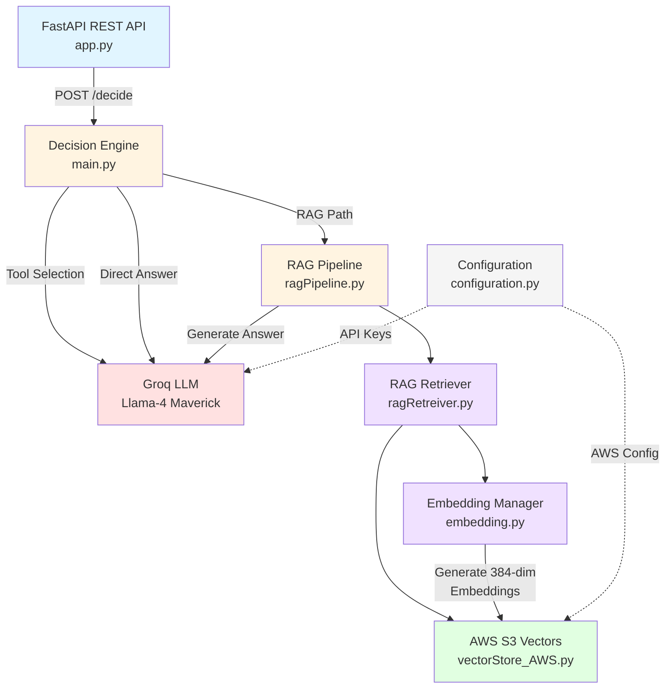

# 🏛️ Indian Income Tax RAG System

> Production-grade Retrieval-Augmented Generation (RAG) system specialized in Indian Income Tax Law, powered by AWS S3 Vectors and Groq LLM inference.

## 📋 Table of Contents

- [Overview](#overview)
- [System Architecture](#system-architecture)
- [Features](#features)
- [Technology Stack](#technology-stack)
- [Installation](#installation)
- [Configuration](#configuration)
- [Usage](#usage)
- [API Documentation](#api-documentation)
- [Architecture Deep Dive](#architecture-deep-dive)
- [Design Patterns](#design-patterns)
- [Performance](#performance)
- [Deployment](#deployment)
- [Testing](#testing)
- [Contributing](#contributing)
- [License](#license)

## 🎯 Overview

This system provides an intelligent legal assistant for Indian Income Tax Law queries by combining:
- **Semantic Search** via AWS S3 Vectors for case law retrieval
- **LLM-powered Reasoning** using Groq's Llama-4 Maverick (17B parameters)
- **Intelligent Routing** between direct answers and RAG-based responses
- **Citation-rich Responses** with source document traceability

### Key Capabilities

- Query classification (general vs. case law requirements)
- Dense semantic search across legal documents
- Context-aware answer generation with judicial citations
- Conversational follow-up questions
- Sub-second vector search latency

## 🏗️ System Architecture

## ✨ Features

### Intelligent Query Routing
- **Automatic Tool Selection**: LLM classifies queries as general (direct answer) vs. specific (RAG required)
- **Query Optimization**: Transforms user questions into dense semantic search queries with statutory context

### Advanced RAG Pipeline
- **Top-K Retrieval**: Configurable document retrieval (default: 10 documents)
- **Score Thresholding**: Minimum similarity filtering (default: 0.3)
- **Metadata Extraction**: Automatic PDF path construction from case metadata
- **Citation Management**: Tracks and lists all referred legal documents

### Conversational AI
- **Context Preservation**: Summary-based conversation history
- **Follow-up Generation**: Intelligent next-step question suggestions
- **Professional Tone**: Legal assistant persona with junior associate-friendly explanations

## 🛠️ Technology Stack

| Component | Technology | Version/Model | Purpose |
|-----------|-----------|---------------|---------|
| **Web Framework** | FastAPI | 0.104+ | REST API endpoints |
| **LLM Provider** | Groq (ChatGroq) | Llama-4 Maverick 17B | Fast inference (128K context) |
| **Vector Database** | AWS S3 Vectors | Boto3 SDK | Distributed vector storage |
| **Embedding Model** | SentenceTransformer | all-MiniLM-L6-v2 | 384-dimensional embeddings |
| **Orchestration** | LangChain | Latest | LLM workflow management |
| **Language** | Python | 3.8+ | Core implementation |

